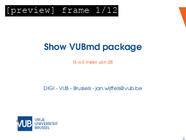

# VUBmd

VUBmd contains templates to generate several types of documents with the identity of the VUB using Rmarkdown. The current package has following Rmarkdown templates:

- VUB slides: presentations rendered to pdf
- VUB article: articles rendered to pdf



The templates are available in RStudio using `File` > `New file` > `R Markdown` > `From template` and are called `VUB slides` and `VUB article`

## Examples

- [Example presentation](vignettes/example-slides.pdf)
- [Example article](vignettes/example-article.pdf)

## Installation

VUBmd requires a working installation of XeLaTeX. We highly recommend to use the TinyTeX. Installation is done as follows.

1. Close all open R sessions and start a fresh R session. 
2. Execute the commands below. This will install TinyTeX on your machine. No admin rights are required. Although TinyTeX is a lightweight installation, it still is several 100 MB large.

```{r}
install.packages("remotes")
install.packages("tinytex")
tinytex::install_tinytex()
```

3. Once TinyTeX is installed, you need to restart RStudio. Then you can proceed with the installation of `VUBmd`.

```{r}
remotes::install_github("DIGI-VUB/VUBmd")
```

4. Once the VUBmd R package is installed, you need to make sure the local_tex folder inside the VUBmd R package is used in tinytex. This is done as follows.

```{r}
tinytex::tlmgr_install('tex-gyre'))
tinytex::tlmgr_install('inconsolata')
tinytex::tlmgr_install('times')
tinytex::tlmgr_install('tex')
tinytex::tlmgr_install('helvetic')
tinytex::tlmgr_install('dvips')
tinytex::tlmgr_install('hyphen-dutch')
tinytex::tlmgr_install('hyphen-french')
tinytex::tlmgr_install('setspace')
tinytex::tlmgr_install('relsize')
tinytex::tlmgr_conf(c("auxtrees", "add", system.file("local_tex", package = "VUBmd")))
```


### DIGI

By DIGI: Brussels Platform for Digital Humanities: https://digi.research.vub.be


